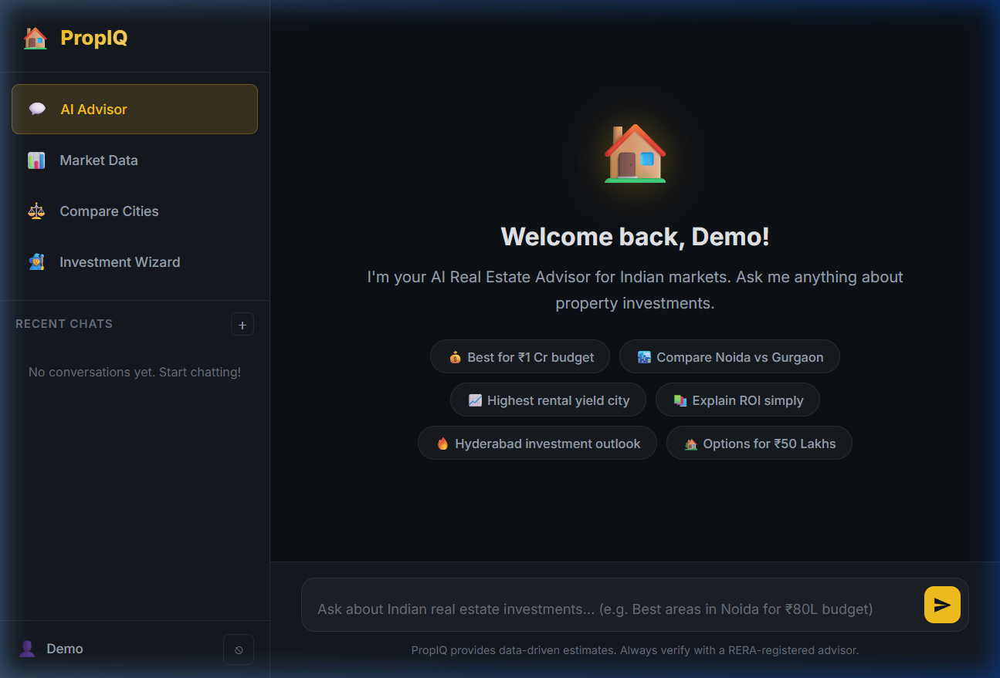
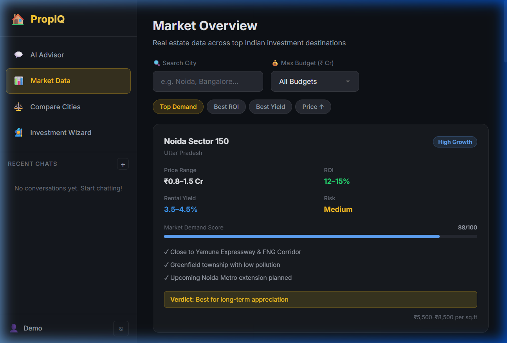
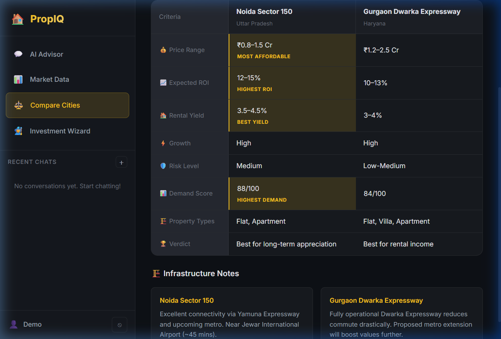
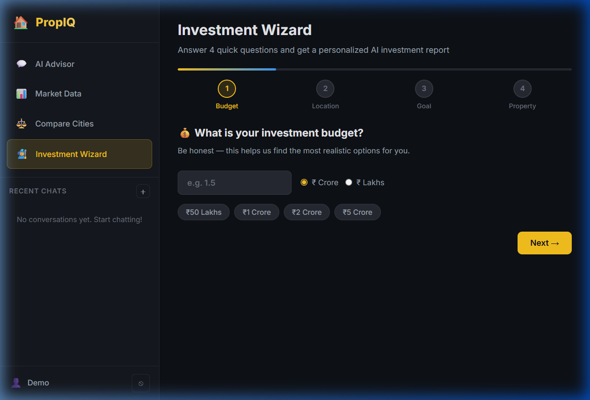

<div align="center">


# 🏠 PropIQ

### AI-Powered Real Estate Investment Advisor for India

[](https://nodejs.org/)
[](https://expressjs.com/)
[](https://sqlite.org/)
[](https://aistudio.google.com/)
[](LICENSE)

**Smart property investment decisions — powered by Google Gemini AI, grounded in Indian market data.**

[Features](#-features) · [Screenshots](#-screenshots) · [Quick Start](#-quick-start) · [API Docs](#-api-reference) · [Tech Stack](#-tech-stack)

</div>

---

## 🎯 What is PropIQ?

PropIQ is a full-stack web application that acts as your personal real estate investment consultant for the **Indian property market**. It combines:

- 🤖 **AI conversations** with a Gemini-powered advisor that knows Indian real estate
- 📊 **Live market data** for 8 top Indian investment destinations
- ⚖️ **Side-by-side city comparisons** with winner highlights
- 🧙 **Investment Wizard** that generates a personalized AI report in seconds
- 💾 **Persistent chat history** stored securely per user

All designed with a premium dark glassmorphism UI — built without any frontend framework.

---

## ✨ Features

| Feature | Description |
|---|---|
| 🔐 **Auth System** | Register & login with JWT authentication, bcrypt password hashing |
| 💬 **AI Chat Advisor** | Conversational advisor with full session memory, markdown rendering |
| 📊 **Market Dashboard** | 8 Indian cities with ROI, rental yield, demand score, filter & sort |
| ⚖️ **City Comparison** | Select 2–3 cities for a detailed side-by-side investment analysis |
| 🧙 **Investment Wizard** | 4-step form → personalised AI-generated investment report |
| 📜 **History** | All chats and wizard reports saved to SQLite, restorable anytime |
| 🛡️ **Rate Limiting** | 30 AI requests/hour per IP to prevent abuse |
| 🔒 **Secure API** | Gemini API key lives on the server — never exposed to the browser |

---

## 📸 Screenshots

### AI Advisor Chat


### Market Overview Dashboard


### City Comparison Tool


### Investment Wizard


### Auth Screen


---

## 🚀 Quick Start

### Prerequisites
- **Node.js** v18+ ([download](https://nodejs.org/))
- **Google Gemini API key** — free at [aistudio.google.com](https://aistudio.google.com/)

### 1. Clone the repo
```bash
git clone https://github.com/YOUR_USERNAME/Real-Estate-AI-Investment-Advisor.git
cd Real-Estate-AI-Investment-Advisor
```

### 2. Install dependencies
```bash
npm install
```

### 3. Set up environment variables
```bash
cp .env.example .env
```
Open `.env` and fill in your values:
```env
GEMINI_API_KEY=your_gemini_api_key_here    # From aistudio.google.com
JWT_SECRET=any_long_random_secret_string   # e.g. use: openssl rand -base64 32
PORT=3000
```

### 4. Start the server
```bash
# Development (auto-restarts on changes)
npm run dev

# Production
npm start
```

### 5. Open the app
```
http://localhost:3000
```

Register an account and start asking the AI about Indian real estate! 🏠

> **Note:** The SQLite database file (`advisor.db`) is created automatically on the first run. No database setup required.

---

## 🏙️ Covered Indian Markets

| City / Area | Price Range | ROI | Rental Yield | Growth |
|---|---|---|---|---|
| Noida Sector 150 | ₹0.8–1.5 Cr | 12–15% | 3.5–4.5% | 🟢 High |
| Gurgaon Dwarka Expressway | ₹1.2–2.5 Cr | 10–13% | 3–4% | 🟢 High |
| Delhi L-Zone / Dwarka | ₹1.5–3.0 Cr | 8–11% | 2.5–3.5% | 🟡 Medium |
| Navi Mumbai / Panvel | ₹0.7–1.8 Cr | 11–14% | 4–5% | 🟢 High |
| Bangalore Sarjapur Road | ₹0.9–2.2 Cr | 13–16% | 4–5.5% | 🟢 High |
| Pune Hinjewadi | ₹0.6–1.4 Cr | 12–15% | 4–5% | 🟢 High |
| Hyderabad HITECH City | ₹0.8–1.8 Cr | 13–17% | 4.5–5.5% | 🔵 Very High |
| Chennai OMR | ₹0.5–1.3 Cr | 10–13% | 4–5% | 🟡 Medium |

> *Data represents realistic 2024–2025 market estimates. Always verify with a RERA-registered advisor before investing.*

---

## 🗂️ Project Structure

```
Real-Estate-AI-Investment-Advisor/
│
├── .env.example              # Environment variable template
├── package.json              # Dependencies & scripts
│
├── server/                   # Backend (Node.js + Express)
│   ├── index.js              # App entry point
│   ├── db.js                 # SQLite setup via Knex
│   ├── middleware/
│   │   ├── auth.js           # JWT verification
│   │   └── rateLimiter.js    # Rate limiting
│   ├── routes/               # Route definitions
│   ├── controllers/          # Business logic
│   ├── services/
│   │   └── gemini.service.js # AI integration + system prompt
│   └── data/
│       └── marketData.js     # Curated Indian city data
│
├── public/                   # Frontend (Vanilla HTML/CSS/JS)
│   ├── index.html            # Single-page app shell
│   ├── css/styles.css        # Design system & components
│   └── js/
│       ├── api.js            # Centralized fetch client
│       ├── auth.js           # Auth state management
│       ├── app.js            # SPA router + bootstrap
│       ├── chat.js           # Chat interface
│       ├── dashboard.js      # Market data cards
│       ├── compare.js        # City comparison
│       └── wizard.js         # Investment wizard
│
└── docs/screenshots/         # UI screenshots for README
```

---

## 📡 API Reference

All API endpoints are prefixed with `/api`. Protected routes require:
```
Authorization: Bearer <your_jwt_token>
```

### Auth
| Method | Endpoint | Auth | Description |
|---|---|---|---|
| `POST` | `/api/auth/register` | ❌ | Create account |
| `POST` | `/api/auth/login` | ❌ | Login → JWT |
| `GET` | `/api/auth/me` | ✅ | Current user |

### Chat
| Method | Endpoint | Auth | Description |
|---|---|---|---|
| `POST` | `/api/chat/message` | ✅ | Send message, get AI response |
| `GET` | `/api/chat/sessions` | ✅ | List all past sessions |
| `GET` | `/api/chat/sessions/:id` | ✅ | Get session messages |
| `DELETE` | `/api/chat/sessions/:id` | ✅ | Delete a session |

### Market Data *(public — no auth)*
| Method | Endpoint | Description |
|---|---|---|
| `GET` | `/api/market/cities` | All cities (`?budget=1.5&city=Noida`) |
| `GET` | `/api/market/cities/:slug` | Single city detail |
| `GET` | `/api/market/compare?cities=slug1,slug2` | Compare 2–3 cities |

### Recommendations
| Method | Endpoint | Auth | Description |
|---|---|---|---|
| `POST` | `/api/recommend` | ✅ | Run wizard → AI report |
| `GET` | `/api/recommend/history` | ✅ | Past wizard reports |

---

## 🛠️ Tech Stack

### Backend
- **[Node.js](https://nodejs.org/)** + **[Express 4](https://expressjs.com/)** — HTTP server & API
- **[SQLite](https://sqlite.org/)** via **[Knex.js](https://knexjs.org/)** — file-based database, zero setup
- **[@google/generative-ai](https://www.npmjs.com/package/@google/generative-ai)** — Gemini 2.0 Flash
- **[bcryptjs](https://www.npmjs.com/package/bcryptjs)** — password hashing
- **[jsonwebtoken](https://www.npmjs.com/package/jsonwebtoken)** — JWT auth
- **[helmet](https://helmetjs.github.io/)** + **[express-rate-limit](https://www.npmjs.com/package/express-rate-limit)** — security

### Frontend
- **Vanilla HTML5** — no framework, no build step
- **Vanilla CSS** — CSS custom properties, glassmorphism, animations
- **Vanilla JavaScript** — async/await, fetch API, ES6 modules pattern
- **[Marked.js](https://marked.js.org/)** (CDN) — markdown rendering for AI responses
- **[Inter](https://fonts.google.com/specimen/Inter)** (Google Fonts) — typography

---

## 🔒 Security

- ✅ Gemini API key stored in `.env` — **never sent to the browser**
- ✅ Passwords hashed with `bcrypt` (10 salt rounds)
- ✅ JWT with 7-day expiry
- ✅ Every database query scoped to `user_id` — no cross-user data leaks
- ✅ Rate limiting: 100 req/15min (general), 30 AI req/hour
- ✅ `helmet` for secure HTTP headers
- ✅ `.env` and `advisor.db` excluded from Git

---

## 📁 Documentation

| File | Description |
|---|---|
| [`PROJECT_EXPLANATION.md`](PROJECT_EXPLANATION.md) | Plain-English explanation of every decision and file |
| [`TECHNICAL_DETAILS.md`](TECHNICAL_DETAILS.md) | Full API reference, DB schema, design system, architecture |

---

## 🤝 Contributing

1. Fork the repo
2. Create a feature branch: `git checkout -b feature/my-feature`
3. Commit your changes: `git commit -m 'Add my feature'`
4. Push to the branch: `git push origin feature/my-feature`
5. Open a Pull Request

---

## 📄 License

This project is licensed under the **MIT License** — see the [LICENSE](LICENSE) file for details.

---

## ⚠️ Disclaimer

PropIQ provides AI-generated, data-driven estimates for educational and research purposes.  
**Always consult a RERA-registered real estate advisor before making any investment decisions.**  
Price and yield data are approximate and based on publicly available 2024–2025 market information.

---

<div align="center">

Made with ❤️ for Indian real estate investors

**[⬆ Back to top](#-propiq)**

</div>
